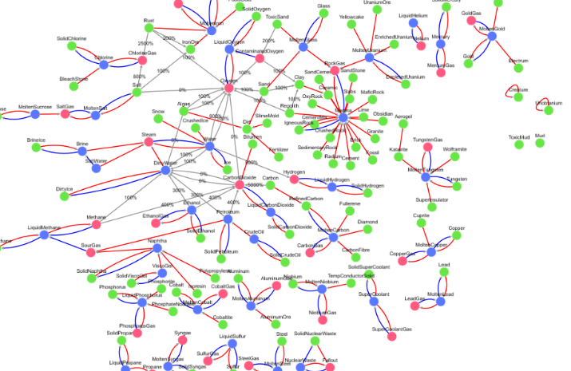

# ONI-ElementGraph

This project is the creation of a graph about game Oxygen Not Included.
This graph show every matter change in the game.

## Legend
- Red arrows show heat-induced element change.
- Blue arrows show cold-induced element change.
- Grey arrows show element change by factory or mobs. (WARNING, Grey arrows are not exaustives)

## Image

[Complete diagram output here](./output/full_diagram.svg)
